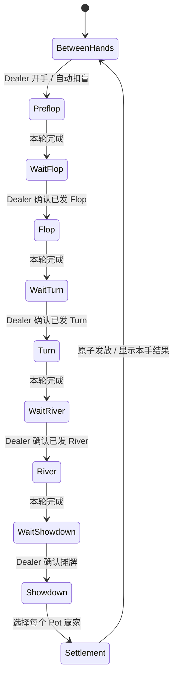

# Poker · 数字筹码与荷官辅助应用设计

日期：2026-09-25

状态：首个可运行 MVP 已实施并完成本地多人验收；CloudBase 数据库迁移、函数发布、静态路由和正式域名切换尚未执行。

正式入口：`https://www.avalonxty.site/poker`。

## 1. 产品定位与设计决定

朋友线下聚会使用的手机 Web App。实体牌由线下发放和判断；应用负责玩家、座位、数字筹码、下注顺序、主池/边池、荷官确认、结算、纠错及整晚记录。不录入底牌，不推断牌型或推荐打法。

Poker 与 Avalon 是并列应用：同一仓库、同一 CloudBase 环境，分别拥有前端入口、业务代码、身份命名空间、云函数、数据库表、构建产物和发布流程。未来可以把整个 `apps/poker/` 搬出成为独立仓库。

首版决定：

- 延续 React 19、TypeScript、Vite、普通 CloudBase Event 云函数、PostgreSQL 和现有移动端视觉风格。
- 2–10 位入座玩家；房间最多 32 位成员，其余为旁观者。房主可不入座。
- 所有玩家剩余筹码、每轮下注、整手投入和游戏动作均向房间成员公开。
- No-Limit 下注。`Pot` 按钮是金额计算器，不是 Pot-Limit 下注上限。
- 玩家自己行动；房主及被授权的 Dealer 管理发牌节奏、裁定与纠错。Button 与 Dealer 是两个独立概念。
- 自动识别一轮结束，进入“等待荷官确认”，不直接跨过线下发牌步骤。
- 每笔筹码变化都记账；所有修改由服务端事务执行，客户端不计算最终有效余额。
- 同一手锁定座位、参与者及盲注。新增、离座、换座、补码在手间生效。
- 撤销保留历史，以新增事件表达回退；权限、房间版本和幂等记录不随之回退。

### 1.1 牌组口径

应用不区分 Standard 和 Short Deck，也不提供牌组设置。实体牌、牌组和牌型约定均由线下玩家处理；应用只按 SB/BB 无限注规则记录行动和筹码。

## 2. 现有项目核对与复用范围

本次读取代码后的事实：

- 根目录当前是单个 Avalon 项目：`src/`、`shared/`、`server/`、`cloudbase/`、`cloudfunctions/avalon/`。
- `server/api.ts` 已实现命令白名单、版本/阶段检查和请求去重；`server/postgres-store.ts` 通过 SQL RPC 做带修订号的原子提交。
- `server/store.ts` 的集合枚举、前缀和过期逻辑包含 Avalon 业务，不能直接给 Poker 换个名字就共用整套状态。
- `src/api.ts` 已有 guest 身份持久化、前后台切换、轮询、网络恢复与待确认请求处理。
- `src/styles.css` 使用浅纸色背景、白色卡片、森林绿主色、中文系统字体及至少 48px 高输入框。
- 仓库部署资料记录现有环境在新加坡、数据库为 PostgreSQL；这是仓库配置事实，本次未登录控制台核验线上资源。
- `.github/workflows/pages.yml` 推送 main 时发布 Pages；`deploy.yml` 可发布 Avalon 云函数及 CloudBase 根目录静态文件。引入 Poker 后必须拆开发布目标，避免根目录发布覆盖 `/poker`。

复用身份签名、请求校验、事务提交、轮询恢复、二维码、数字输入、座位排序的实现经验及适用代码；Poker 自己维护下注引擎、筹码账本和权限投影。复制时保留必要的依赖修复、许可证与来源说明，不复制 Avalon 的秘密角色、笔记、投票或清理规则。

首版用独立 npm 项目和各自锁文件，不建立运行时跨应用 import。少量稳定 UI 可以先复制；确有重复维护成本时再提取可版本化包，避免拆仓需要同时搬走整个另一应用。

## 3. 目录、资源与部署隔离

### 3.1 目标目录

```text
repo/
├── apps/
│   ├── avalon/                    # 现有完整应用迁入，保留功能与身份兼容
│   │   ├── src/ shared/ server/
│   │   ├── cloudbase/ cloudfunctions/avalon/
│   │   ├── scripts/ tests/ docs/ public/ vendor/
│   │   └── package.json package-lock.json vite.config.ts ...
│   └── poker/                     # 可整体拆成独立仓库
│       ├── plan.md
│       ├── README.md
│       ├── package.json package-lock.json
│       ├── vite.config.ts tsconfig.json vitest.config.ts
│       ├── playwright.config.ts index.html .env.example
│       ├── src/
│       │   ├── app/                # 入口、导航、连接状态
│       │   ├── features/           # 房间、牌桌、下注、荷官、历史、汇总
│       │   ├── components/         # Poker 自己的通用控件
│       │   ├── api/                # 通信、身份、恢复、幂等请求
│       │   └── styles/
│       ├── shared/                 # 契约、错误码、公开类型、整数金额工具
│       ├── server/
│       │   ├── domain/             # 纯状态机、下注、边池、轮换、账本、纠错
│       │   ├── application/        # 命令处理、权限、事务、投影、摘要
│       │   ├── infrastructure/     # 文件存储、PostgreSQL、身份、HTTP
│       │   └── local.ts cloud.ts
│       ├── cloudbase/migrations/   # 只操作 poker_* 资源
│       ├── cloudfunctions/poker/   # 构建产物和独立生产依赖
│       ├── scripts/                # 构建、迁移检查、发布、导出
│       ├── tests/                  # domain / api / postgres / e2e
│       ├── public/                 # Poker 图标、静态文件
│       ├── vendor/                 # 如需沿用依赖兼容补丁，随应用携带
│       └── docs/                   # 部署、运维与规则说明
├── .github/workflows/              # 按应用检查和发布
├── docs/deployment/                # 共享域名/网关的配置清单
├── package.json                   # 仅提供仓库级命令入口
├── README.md                      # 两个应用导航
└── plan.md                        # 现有实施历史及新计划索引
```

实际整理分两个独立变更：先迁移 Avalon 路径并验证原有构建，再增加 Poker。当前文档先位于 `apps/poker/plan.md`，不提前移动现有源代码。

每个应用可在自己的目录 `npm ci`、`npm run dev`、`npm run check`、`npm run build`。根命令仅转发，不隐式构建或发布另一个应用。本地端口分别为 Avalon 5173/8787、Poker 5174/8788；数据分别写到各自 `.data/`。

### 3.2 线上资源映射

| 资源              | Avalon                        | Poker                              |
| ----------------- | ----------------------------- | ---------------------------------- |
| 网页              | `https://www.avalonxty.site/` | `https://www.avalonxty.site/poker` |
| 静态应用/发布目标 | GitHub Pages `dist/`          | GitHub Pages `dist/poker/`         |
| 静态资源 URL      | `/assets/...`                 | `/poker/assets/...`                |
| HTTP API          | `/api/avalon`                 | `/api/poker`                       |
| 云函数            | `avalon`                      | `poker`                            |
| 数据库资源        | 原 `avalon_*`                 | 新 `poker_*`                       |
| 本地存储前缀      | 原 `avalon.v1.`               | `poker.v1.`                        |
| 会话身份          | 保留原签名/身份密钥           | 独立密钥、`aud=poker`              |
| 构建产物          | 仓库根 `dist/`                | 合并到仓库根 `dist/poker/`         |
| 清理任务          | `avalon-cleanup`              | `poker-cleanup`                    |
| 发布版本          | `avalon-v*`，兼容原流程       | `poker-v*`                         |

同源路径隔离用于代码和运维边界，不提供浏览器安全沙箱；浏览器同源存储可被同源脚本读取。保持独立 Token audience、服务器鉴权与应用命名空间，不将路径当作权限控制。

### 3.3 `/poker` 的访问与迁移

2026-09-28 的发布决策是两个前端继续共用 GitHub Pages：`/` 为 Avalon，`/poker/` 为 Poker。CloudBase 只承载后端，在默认 API 域名下将 `/api/avalon` 与 `/api/poker` 分别路由到两个函数。前端与 API 跨域，允许来源统一为 `https://www.avalonxty.site`。

Poker 使用 Vite `base=/poker/`。首版主入口用 `/poker/?room=房号`，内部面板用状态或 hash 导航，不要求服务器支持任意深层路径。`/poker` 正确跳转或规范化到 `/poker/`，保留 query/hash；两种地址均能进入同一应用。二维码、分享与刷新均保留前缀。

Pages 工作流先构建 Avalon，再用 Poker 固定的 `/poker/` base 构建独立资源，最后只把 Poker 产物复制到根产物的 `poker/` 目录。CloudBase 声明式部署先执行 `poker_*` 数据库迁移，再发布独立函数、清理任务和 `/api/poker` 路由。两个流程均由推送到 `main` 触发。

API 缓存为 `no-store`；HTML 短缓存/不缓存，hash 静态资源长期缓存。CORS 的 origin 为 `https://www.avalonxty.site`，不带 `/poker`。首版不注册 Service Worker，避免范围或旧缓存覆盖另一应用。

## 4. 房间、成员、玩家与权限

### 4.1 分离概念

- `RoomMember`：已认证的房间成员，可为玩家或旁观者。
- `SessionParticipant`：整晚账务主体，保存初始筹码、补码、离桌记录及历史，即使离席也不删除。
- `Seat`：当前牌桌位置，引用参与者；玩家 ID 与座位 ID 独立。
- `HandPlayer`：开手时冻结的参与者与座位快照。后续成员离开不改掉当前手的记录。
- `ownerMemberId`：房主，始终拥有最高权限。
- `dealerMemberId`：房主指派的一个额外操作员，可为空，可指向旁观者。房主始终可执行 Dealer 操作。
- `buttonSeatId`：牌局轮换标记。Button 玩家不会因此获得荷官权限。

旁观者没有座位和可用筹码，不能被设为行动玩家；曾参与过游戏后离席成为旁观者的人，历史账务记录仍保留。

### 4.2 权限矩阵

| 动作                         | 普通玩家   | 普通旁观者 | Dealer（可为玩家/旁观者） | 房主               |
| ---------------------------- | ---------- | ---------- | ------------------------- | ------------------ |
| 看公开牌桌、历史和汇总       | 是         | 是         | 是                        | 是                 |
| 对自己的手牌下注             | 仅本人回合 | 否         | 若入座，仅本人回合        | 若入座，仅本人回合 |
| 申请入座/离座/补码           | 是         | 可申请入座 | 是                        | 是                 |
| 确认开始下一手/下一 Street   | 否         | 否         | 是                        | 是                 |
| 暂停/继续、手内纠错/撤销     | 否         | 否         | 是                        | 是                 |
| 指定各池赢家、确认发放       | 否         | 否         | 是                        | 是                 |
| 按房间策略批准 refill/rebuy  | 否         | 否         | 是                        | 是                 |
| 配置规则、改座次、增删入座者 | 否         | 否         | 否                        | 是                 |
| 指派、转移、收回 Dealer      | 否         | 否         | 否                        | 是                 |
| 外部筹码校正、身份重新绑定   | 否         | 否         | 否                        | 是                 |
| 转移房主、结束 Session       | 否         | 否         | 否                        | 是                 |

每次提交都从数据库读取当前权限。房主收回 Dealer 后，原 Dealer 的打开页面、旧 Token 和待提交草稿均不能继续操作；提交与收权并发时由事务序列决定，先提交成功的动作记入历史，后发生的收权立即生效。

Dealer 不能用普通 `player.act` 给别人下注；修正录错行为必须走暂停后的纠错命令，公开标记操作者、原玩家和原因。

### 4.3 动态人员与座次

- 中途加入默认旁观；申请入座在下一手前由房主确认。
- 活跃手中的参与者不能直接被删掉或换 ID。离座/踢出请求标记为手后生效；其尚未结束的手由本人继续，或者暂停后由 Dealer 使用明确的纠错流程处理。
- 断线、锁屏不等于 fold，不自动跳过行动。零筹码者可留座等待 rebuy，下一手没有筹码则 sit-out。
- 座次按顺时针维护，支持拖动与上移/下移；手内只能编辑下一手草稿，当前行动顺序不变。
- 手间处理顺序固定：结算 → 批准补码/离座 → 应用座次 → 确认盲注及下一 Button → 开手。
- 若只有一位有筹码且准备好的玩家，禁止开手。
- 同一身份恢复原成员；同一个 Session 的重新入座关联原账务主体，不伪造第二份“初始筹码”。

房主离开房间前需把房主身份转移给仍在房间的成员，或先结束 Session；断线不视为主动离开。被授权 Dealer 主动离开/被移除时撤销其额外权限，房主继续可操作。身份恢复、权限转移均保留审计记录。

## 5. 筹码、盲注与轮换

### 5.1 金额表示

所有金额为非负整数筹码单位。房间可设最小面额 `chipUnit`（默认 1），存储时转换成最小单位整数，UI 再乘回面额。输入拒绝小数、负数、NaN、无穷及不整除面额的数；不使用浮点钱数。

单次配码/筹码输入上限 10^9 个最小单位，Session 累计发行上限 10^12；中间计算也检查安全整数范围。比例快捷金额用整数分子/分母计算并向上取整至一个单位。

### 5.2 盲注设置

配置：默认初始筹码、SB、BB、盲注级别列表、升级方式、refill/rebuy 默认数量与允许范围。校验 `0 < SB <= BB`，不强制 BB 恰好为 SB 两倍。

建房初始建议为每人 2,000、SB/BB=10/20、手动升级、补码默认 2,000，由房主在开手前修改。规则及盲注计划的修改在下一手生效，当前手保存完整配置快照。

升级方式：

- 手动：Dealer 选择下一级，下一手生效。
- 按手数：每 N 手有效完成的牌后升级；撤销结算或作废的手不重复计数。
- 按时间：按服务端的 Session 有效运行时间确定级别；暂停时冻结计时，锁屏时继续计时。

手内级别固定。达到升级点显示“下一手升至 20/40”；`hand.start` 在事务中计算并确认本手配置，记录生效的级别。提交携带开手预览标识，若时钟越过级别导致扣盲金额改变，返回新预览让 Dealer 再确认，不能按旧预览暗中扣更大盲注。

### 5.3 Button / SB / BB

首手房主选择 Button，开手预览明确列出 Button、SB、BB 和第一行动者。之后自动轮换。

- 3 人及以上：Button 左侧第一位参与玩家为 SB，再下一位为 BB；Preflop 从 BB 左侧第一位可行动玩家开始；后续 Street 从 Button 左侧第一位可行动玩家开始。
- 开手时就是两人：Button 同时为 SB，Preflop 先行动，Flop 以后另一人先行动。
- 一手中途 fold 到两人不改成 heads-up 的位置规则，保持本手快照。
- 新手从多人变为两人时，优先让上一手的 BB 不再连续当 BB；依据冻结的上一手位置和新参与名单计算并展示。
- 普通下一手按顺时针移动 Button，跳过不参与者；离席的旧位置保留轮换锚点。改座次后房主确认新的下一 Button，不把数组下标误当玩家身份。

家庭局采用明确的 **moving button** 规则；人员变化时不追缴错过的盲注，不模拟锦标赛 dead button。此规则在建房帮助说明，不能声称等同于所有赌场/赛事的轮换制度。

### 5.4 自动扣盲

`hand.start` 原子地冻结名单、分配位置、扣 SB/BB、建立行动队列并写日志。重复开手请求不会重复扣款或再次移动 Button。

实际扣款为 `min(stack, blind)`；不足盲注则 All-in。Preflop 的标准跟注基准仍为完整 BB，`lastFullRaiseSize=BB`，不能把短筹码 BB 的实际缴款变成全桌的新盲注。

有多位仍可下注者时按完整 BB 行动；若只剩一位可下注者面对已 All-in 的对手，其仅需回应真实待匹配下注，不为虚拟 BB 制造单人边池。已超过其他玩家真实投入的未跟注部分在闭轮时退回。

## 6. 状态模型与事件

核心类型由 `shared/` 定义契约，服务端 domain 拥有唯一权威实现。

```ts
type Street = 'PREFLOP' | 'FLOP' | 'TURN' | 'RIVER' | 'SHOWDOWN';
type HandPhase =
  | 'BETTING'
  | 'AWAITING_STREET_CONFIRMATION'
  | 'SHOWDOWN'
  | 'AWAITING_SETTLEMENT'
  | 'SETTLED'
  | 'VOIDED';

interface HandPlayer {
  participantId: string;
  seatId: string;
  stack: number;
  streetCommitted: number;
  handCommitted: number; // 本手净投入，已减去退回的未跟注金额
  folded: boolean;
  allIn: boolean;
  hasActed: boolean;
  reopenAtBet: number | null;
}

interface BettingRound {
  street: Street;
  currentBet: number;
  lastFullRaiseSize: number;
  needsAction: string[];
  actorId: string | null;
}
```

其他必要字段：

- 房间：`roomId(UUID)`、短房号、`sessionId`、`ownerMemberId`、`dealerMemberId`、成员、座位、待生效更改、`roomVersion`、`permissionEpoch`。
- Session：运行/暂停/结束状态、时间基准、盲注计划、账务主体、最近已结算手、汇总版本。
- Hand：不可复用的 `handId`、展示序号、规则版本、开手快照、筹码快照、当前 Street、当前阶段、待确认 Street、局面修订号 `handRevision`、本手位置快照。
- Pot：`potId`、分层区间、金额、贡献者、争夺资格、是否仍可增长。未匹配的最高下注单列 `uncalled`，不假装它已形成边池。
- 事件：单调递增 `eventSeq`、类型、实际操作者、业务玩家、时间、请求 ID、状态前后版本、金额变化、原因、被撤销事件引用及规则版本。

客户端只收到公开房间投影、自己的可用动作和权限。内部身份映射、密钥、请求摘要、完整回退快照不下发。

## 7. 下注状态机



暂停是覆盖层：保留 Street、actor、待确认阶段；禁止下注、开手和推进，但允许房主改权限、Dealer 纠错、成员恢复连接。

特殊分支：

- 只剩一位未 fold 玩家：结束下注，退回未跟注部分，自动生成其获胜的结算预览，Dealer 确认后发放；无需走完公共牌。
- 多位存活但不足两位有可下注筹码：先处理最后仍欠的 Call/Fold；下注齐平后由 Dealer 一次确认“已发完公共牌”，直接进入 Showdown，不再逐街重复确认。
- 仍有至少两位可下注玩家：即使已有 All-in，后续 Street 仍正常行动，新增投入形成或增大他们的边池。
- 结算成功进入手间；开始下一手仍由 Dealer 确认，给予补码、离座和纠错时间。

### 7.1 六种操作的合法性

定义：`b=streetCommitted`，`s=stack`，`H=currentBet`，`R=lastFullRaiseSize`，`callNeeded=max(0,H-b)`，`maxTo=b+s`。单一可下注者的特殊跟注基准按 5.4 节处理。

| 操作   | 校验及效果                                                                                             |
| ------ | ------------------------------------------------------------------------------------------------------ |
| Fold   | 必须是本人回合且未 Fold/All-in；放弃本手所有 Pot 资格，已投入留池。可免费 Check 时弱化 Fold 并二次确认 |
| Check  | `callNeeded=0` 才合法；计为已行动                                                                      |
| Call   | `callNeeded>0`；实际转入 `min(s,callNeeded)`，筹码耗尽则 All-in；不允许以任意更少金额 Call             |
| Bet    | `H=0`；输入本轮目标总额，至少本级 BB；不足最低 Bet 仅能用尽全部筹码                                    |
| Raise  | `H>0` 且有加注权；目标 `raiseTo >= H+R`，且 `raiseTo<=maxTo`；不足最小加注仅允许 All-in                |
| All-in | 目标 `maxTo`；小于等于 H 时是全部筹码 Call，大于 H 时按 Raise 权限与不足额加注规则处理                 |

拒绝非本人回合、旁观者、已弃牌者、已 All-in 者、暂停中、等待荷官确认阶段的下注。房主也不能绕过普通下注规则。

UI 与 API 均用 **“加到本轮总额”**，而不是模糊的“加多少”。例如本轮已下 50、桌面最高 100、加到 300，按钮明确“加到 300 · 再投入 250”。

### 7.2 最小加注与重新开放加注

每轮初始化 `R=BB`。完整开注把 R 设置为实际开注额；完整加注的增量为 `newH-oldH`，达到原 R 才更新 R；不足额 All-in 会提高 H，但不缩小 R。

每位玩家正常行动后记下 `reopenAtBet=行动后H+当时R`。尚未行动（包括仅强制缴盲）的玩家保留加注权；已经行动者需当前 H 达到自己的 `reopenAtBet` 才重新获得加注权。这样多个短 All-in 可以累计对某个人开放加注，但不错误开放给中途刚 Call 的人。

此外，Bet/Raise 必须至少还有一位未弃牌且有剩余筹码的对手可回应。所有对手都 All-in 时，不能独自给空边池下注；无加注权的玩家也不能通过 All-in 按钮绕过限制。

设计验证例：

- BB=100，A 加到 300，增量 200；B All-in 到 450。A 回来只面对额外 150，不可再加；尚未行动的 C 可加到至少 650。
- BB=100，A Bet 100；B All-in 150；C All-in 200。若中间没有其他行动，回到 A 已累计面对 100，允许加到至少 300。
- 上例若 D 在 150 时已 Call，回到 D 面对 200 只多 50，D 仍无加注权。
- Flop 最小开注 100，A 已 Check，B All-in 40：未行动的 C 可 Call 40 或加到至少 140；如果其他人仅 Call，A 面对不足一个完整开注，不能再 Raise。累计到 100 后 A 的加注权才恢复。
- Preflop 所有人 Call 完整 BB 后，BB 仍拥有 Check/Raise 的选择；强制扣盲不算已行动。

不采用实体筹码“投出一半算加注”的模糊判断。数字输入必须是明确合法意图，不足最小值的普通 Raise 直接返回错误，UI 不偷偷改成 Call。

### 7.3 本轮何时结束

维护 `needsAction` 与金额匹配两个条件，不能只比较每个人投入。

1. 新 Street 将所有未 Fold、未 All-in 且需要行动的玩家加入集合；Preflop 包含拥有选择权的 BB。
2. 完成 Check/Call/Fold 后移除本人。
3. 完整 Bet/Raise 后，其他所有可行动玩家重新需要回应。
4. 不足额 All-in 后，把欠新金额的可行动玩家加回集合，同时保留尚未获得行动机会的玩家；加回行动集合不等于恢复加注权。
5. 当集合为空，且每位非 Fold/All-in 玩家达到有效跟注基准，才关闭本轮。单一可下注者使用上述特殊分支。
6. 关闭动作的同一个事务完成未跟注退回、Pot 重算及设置待确认阶段；不能靠下一次轮询补做。

进入下一 Street 时清零 `streetCommitted`，保留 `handCommitted`；重新初始化 H、R 和行动标记。`actorId=null` 表示等待荷官或已结束，不把 Button 或 Dealer 填成假行动玩家。

只有一位可下注者且其已匹配所有存活对手的真实下注时，清除多余的 `needsAction`，走发牌确认；不要要求该玩家空转 Check。若尚欠真实下注，保留其 Call/Fold 选择，Bet/Raise 仍禁用。

## 8. 快捷金额

服务端在 `legalActions` 中返回 `callNeeded`、`callPayable`、`minBetTo`/`minRaiseTo`、`maxTo`、是否可加注、限制原因及快捷金额。前端可预览同一纯整数计算，但提交后仍按最新服务端状态验证。

设 P 为当前全部未发放筹码（包含本轮桌面下注，不能重复加一次），C 为需要补的完整 Call，b 为本人本轮已下注，r 为比例：

- 无人下注：`betTo=ceil(r×P)`。
- 面对下注且能跟足：`raiseTo=b+C+ceil(r×(P+C))`，即先 Call，再按 Call 后底池比例加注。
- 不足跟注时仅提供 “All-in Call 实际金额”，不展示假的加注建议。

例如 P=300、本人 b=0、需 Call 100，1/2 Pot 对应“加到 300”：Call 100 后底池 400，再加 200；实际新投入 300。

快捷区默认显示最小合法金额、1/2 Pot、1 Pot、All-in；展开可选 1/3、2/3、3/4。按最小合法值向上调整、按自身筹码截断、去重并明确标记实际金额；截断为不足额加注时必须满足 All-in 条件。调整后不得继续显示误导性的精确比例标签，应显示“最低加注”等实际含义。

有边池时 P 使用整手未发放总额，UI 明示该计算口径；不暗示玩家一定有资格赢取全部 Pot。允许超过 1 Pot 的合法 No-Limit 手动下注。

## 9. 主池、边池与未跟注退回

### 9.1 分层算法

以每个参与者本手净投入 `c[i]` 为输入，包括已 Fold 玩家的投入。

1. 对全部正投入去重排序：`L1 < L2 < ... < Ln`，`L0=0`。
2. 第 k 层金额：`(Lk-L(k-1)) × count(c[i]>=Lk)`。
3. 该层贡献者是 `c[i]>=Lk` 的所有人；可争夺者是这些人中尚未 Fold 的玩家。
4. 相邻层若资格集合相同，可合并显示为同一个 Pot，保存原分层明细便于审计。
5. 只有一个贡献者的最高层是尚未被跟注金额，不展示成单人 Side Pot。
6. 闭轮或提前结束时先退回未跟注部分，再生成最终可分配的 Pot；资格为空的层视为内部不变量失败，暂停纠错，不丢弃金额或随便指定赢家。

每次合法动作后都从净投入重算，首版不维护一组可以被单独随意编辑的 Pot 数字。新下注只有跨过某位 All-in 玩家累计投入上限的部分才进入更高层。

正在下注时，尚未 All-in 玩家的当前投入较低不代表永久失去高层资格；其后续跟注会更新分层。UI 只在确有 All-in 上限形成不同争夺范围、且更高层已被至少两人匹配时展示边池；仅因其他玩家还没来得及跟注产生的临时分层，展示为本轮待匹配下注。尚未封口的实际边池标记“进行中”。没有实际边池时整个 Side Pot 区域隐藏。

### 9.2 未跟注部分

只有在无人还需回应时，才能把本轮唯一最高下注与第二高实际下注之差退回。比较时包括 Fold 玩家的实际下注；否则会错误返还本应留在池里的弃牌筹码。

退回会减少 `streetCommitted` 和 `handCommitted`、增加 stack，记录 `UNCALLED_RETURNED`；若玩家因此不再是零筹码，更新 All-in 展示。强制盲注也可能产生应退回的超额。仍有人可以 Call/Fold 时，该金额仅标为未跟注，不能提前退回。

### 9.3 必须落成测试的例子

| 情景                                              | 正确结果                                                                |
| ------------------------------------------------- | ----------------------------------------------------------------------- |
| A=100、B=300、C=500，均结束下注                   | 主池 300：A/B/C；边池 400：B/C；C 退回 200，总发放 700                  |
| A=100、B=300、C=500、D=500                        | 主池 400：A/B/C/D；边池一 600：B/C/D；边池二 400：C/D，总计 1400        |
| 上例 B 已 Fold                                    | 金额仍为 400/600/400；B 从资格中移除；后两层资格同为 C/D，可合并为 1000 |
| A=100、B=100、C=50 且 C Fold                      | 合并显示一个 250 的 Pot，仅 A/B 有资格，隐藏 Side Pot                   |
| A=100 All-in，B/C 各 100；下一街 B/C 各加 200     | 主池保持 300，新增边池 400 仅 B/C 可争夺                                |
| A 本轮 Bet 100，B 已付 40 后 Fold，其他人本轮为 0 | A 的未匹配 60 退回；B 的 40 留池，不能退给 A 的是已被 B 匹配的 40       |

## 10. Showdown 与发放

Dealer 看线下实体牌，对每个 Pot 选择一个或多个赢家。选项仅含该池资格玩家；Fold 玩家和低投入不合格玩家不可选择。只有一名资格玩家的 Pot 自动预填。

流程：进入 Showdown → 编辑所有 Pot 的赢家 → 预览每人所得、各池拆分与余数 → 一次确认发放。草稿与真实筹码分离，保存草稿不增加余额。其他成员可看到草稿并在线下核对。

对金额 Q、n 位共同赢家：每人先得 `floor(Q/n)` 个最小单位，余下 `Q mod n` 个单位，从**本手 Button 左侧开始按座位顺时针，在该池赢家中依次各发一个**。各池独立计算；采用本手冻结的座次，不能受后续换座影响。

例如 101 单位由 A/B 平分，其中 A 是 Button 左侧先到的赢家：A=51、B=50。预览写明“余数 1 → A”，不由点击顺序决定。

确认时检查所有 Pot 都有赢家、资格正确、草稿引用当前 `potSetHash/handRevision`、分配总和等于 Pot 总额。所有池发放、手状态、余额、账本、汇总和幂等回执在同一事务内完成。中断/重试不会发两遍，也不允许只发完主池就提前开下一手。

确认后显示本手获胜与余额变化，进入手间管理区，主按钮为“开始下一手”。

本手历史仍保存最终净投入、Pot 和分配明细；实际暂存筹码账户归零。后续汇总不得把已经发放的历史 Pot 再算作桌上筹码。

## 11. 撤销与人工纠错

### 11.1 事件与快照

服务端采用“权威当前快照 + 追加事件 + 筹码账本”，无需每次轮询重放整晚日志。每个可撤销命令保存有限的前态检查点/引用及账本影响；事件不物理删除，回退记录 `revertsEventIds` 和补偿账目。

版本永远递增。撤销后生成新的 `handRevision`、`phaseKey`，旧行动请求即使数值恰好相同也不能重新生效。原 requestId 回执保留；重放已撤销命令只返回“该操作曾执行，现已撤销”，不会再下注。

回退只还原牌局与关联筹码状态，不还原房主/Dealer 授权、成员身份绑定、请求去重表、审计序号和服务器时钟。

撤销请求带 `expectedHeadEventId` 和当前版本，服务端定位最近有效命令。旁观者加入、Dealer 变更等独立管理事件可保留；若后续已发生相关玩家余额、座次或开手依赖，则必须先撤销依赖或拒绝跨越，不直接覆盖整张房间快照。

### 11.2 撤销范围

- Dealer/房主可撤销最近一个仍有效的牌局命令；普通玩家点击“申请撤销”只发起请求。
- 一次命令引起的扣款、退回、轮结束判断、行动人切换一起撤销，不能只把 UI 翻回上一页。
- 同一手可按顺序多次回退；回退到更早动作时，明确列出所有依赖其后的动作并将它们一同标为失效，不能保留后续下注套到不同局面。
- 已结算但下一手尚未开始、且没有后续补码/离座等余额依赖时，可撤销本手结算，收回原分配并回到 Showdown；重新分配仍是单次原子事务。
- 若结算后已发生手间筹码变化，先按逆序撤销可撤销的后续变化；无法安全恢复时拒绝直接回滚，使用手间人工调整。
- 下一手已经开始后，不能一键改写上一手并让当前下注继续。需要停在安全边界通过明确的补偿调整处理。
- 撤销 `hand.start` 仅在本手还没有自主下注时可直接执行，退还盲注、恢复上一手轮换锚点和手间状态；重新开手使用新 handId，防止旧请求串入。

### 11.3 人工纠错路径

1. 暂停并展示冻结的操作序号。
2. 选择“回到某个动作前，重新录入”或“手间筹码校正”，填写原因。
3. 前者展示将失效的动作及筹码变化；确认后回退，再由 Dealer 为原玩家录入修正动作，仍接受同一合法性校验。
4. 如果已经发出下一街实体牌，提示荷官确认线下如何处理；软件回退不代表玩家已经看过的牌被收回。无法继续时可以作废整手，按开手快照退还本手全部投入。
5. 手间筹码校正分为玩家间等额转移、外部记录修正。Dealer 可进行保持全桌总量不变的转移；增加/减少系统筹码的外部修正仅房主可做，单独记入 Adjustment，不伪装成胜利或 refill。
6. 全桌显示“谁在何时修正了什么”，确认结果后继续。

调整不得产生负筹码。历史结算错误如果已影响后续牌局，使用补偿账目，保留原手历史及关联说明，不声称已重演所有后续牌。

作废回到扣盲之前的筹码，恢复本手开局的轮换锚点；重开默认使用同一 Button，但使用新的 handId。作废手保留完整历史并标记 VOIDED，不计有效手数，不能让“撤销/重开”反复推动 Button 或按手数升级。

## 12. Refill / Rebuy 与离席账务

- 首次成为 Session 玩家时记 `INITIAL_GRANT`，初始筹码计一次。
- `REFILL`：有剩余筹码时追加；`REBUY`：零筹码后重新补充。两者分别记次数/金额，并展示合计补码次数和总量。
- 玩家提交申请，Dealer/房主按房间策略批准；批准才记账。重复点击、网络重试及被拒绝申请不增加次数。
- 手内申请进入队列，手结束后重新核对筹码和类型再执行；不能给本手 All-in 玩家加筹码使其继续下注。
- 每次补码显示补前/补后余额及整晚累计。撤销补码追加冲销记录，统计按有效账目重算。
- 离席只在手间结清：剩余筹码转入 `EXIT_ARCHIVE`，记录离席筹码，移除活跃 stack；历史保留。
- 同一玩家再次入座继续原账务记录，新的筹码来源另记补码，不重置旧净变化。旁观状态始终没有可操作 stack。

账本账户至少包含参与者可用筹码、当手暂存筹码、离席归档和外部筹码来源。下注是“玩家 → 当手暂存”，退款是反向，结算是“当手暂存 → 玩家”，每个事务的分录平衡。

整晚守恒式（忽略外部来源账户本身）：

```text
当前所有玩家筹码 + 尚未发放的本手投入 + 已离席归档筹码
  = 初始筹码总量 + 有效补码总量 + 外部校正净额
```

玩家净变化：

```text
当前/最终筹码 + 累计离席筹码
  - 初始筹码 - 补码总量 - 外部校正净额
```

正常结束 Session 时无未结算 Pot，所有玩家净变化之和为 0。手内汇总标“进行中”，分别显示投入中的筹码，不能把它算成已经输掉。

## 13. 数据库存储与并发

### 13.1 PostgreSQL 表与边界

| 表                       | 用途与重要约束                                                    |
| ------------------------ | ----------------------------------------------------------------- |
| `poker_users`            | Poker 身份、会话相关元数据、最近房间；不复用 Avalon user 行       |
| `poker_rooms`            | 当前快照、成员/权限、房号、活动 Session、单调版本                 |
| `poker_sessions`         | 整晚信息、规则、计时、保留策略、汇总快照                          |
| `poker_participants`     | 稳定账务主体、身份绑定、入离席与初始额度                          |
| `poker_hands`            | handId、规则版本、位置/开手快照、当前/终态、Pot、结算草稿         |
| `poker_events`           | 追加动作/管理/纠错事件；唯一 `(session_id,event_seq)`             |
| `poker_ledger`           | 筹码分录，关联 eventId/participantId/handId                       |
| `poker_command_receipts` | 唯一 `(room_id,user_id,request_id)`、请求摘要、提交结果和撤销关联 |
| `poker_oauth_states`     | 如果启用微信授权，一次性 state/verifier                           |

短房号只用于查找，任何命令实际绑定 room UUID 和 session UUID，防止房号复用时重放。新建/加入也需要持久化幂等回执，不能依赖浏览器按钮防重复。

当前房间快照只保存实时必要状态和少量最近事件。完整日志按 handId/游标分页；禁止把整晚不断增长的所有历史塞进一条热 JSON 行。

所有表禁止浏览器直读直写；通过函数身份访问。RPC 只操作明确的 `poker_*` 表，不接收任意表名/SQL。迁移文件显式事务化、版本化，Poker 清理任务只接触 Poker 资源。复用环境意味着资源额度和管理员权限共享，表前缀本身不构成独立租户隔离。

### 13.2 原子提交协议

延续现有“纯 TypeScript 引擎 + PostgreSQL RPC 原子提交”的结构：函数读取当前房间/手/所需账务快照，纯函数生成新状态、事件、账目和回执，`poker_commit` 在 SQL 事务中锁定房间和相关记录、检查所有修订号、统一写入。

成功写入必须包括：当前快照、变更的手记录、事件、账目、需要变动的汇总以及幂等回执。不能先改余额再写历史，也不能先返回成功再后台记账。

命令处理顺序：

1. 验证 Token、当前身份及房间访问权。
2. 查 requestId；相同 ID/相同摘要返回既有结果，相同 ID/不同内容拒绝。
3. 核对 room/session/hand、`expectedRoomVersion`、`handRevision`、`phaseKey` 和当前权限。
4. 严格验证动作，计算新状态与分录，检查全部不变量。
5. 数据库事务再次验证读取修订号并原子提交；底层 CAS 冲突只做有限重试，业务版本过期直接返回冲突。
6. 返回确认的 eventId、最新版本与投影。客户端再同步；旧响应不能覆盖更高版本。

幂等回执与 Session 同期保留，首版不照搬 Avalon 只保留最近少量请求的模式，以覆盖长时间锁屏重试及撤销后重放。

### 13.3 数据保留

默认草稿房间 7 天不活动过期；进行中或暂停中的 Session 保留到手动结束，30 天无有效操作后封存，保留最后状态及未结算标记，不自动判胜或丢筹码；封存可由房主在保留期内恢复。

结束/封存后，完整手牌历史、汇总、账本和回执默认保留 90 天，提供下载 JSON 和 CSV 汇总。清理时以 Session 为单位，先核对当前状态和到期时间再删除，避免删到仍被活跃牌局引用的数据。轮询不续期。过期策略在房间说明与导出页可见，不继承 Avalon 的局中 48 小时直接到期逻辑。

## 14. API 与恢复

单个 `/api/poker` JSON 命令端点，延续项目风格；所有写操作带 requestId。主要动作：

```text
auth.guest / auth.wechat.start / auth.wechat.finish / session
room.create / room.join / room.get / room.leave / room.command
history.list / history.hand / summary.get / summary.export
command.status

room.command:
  seats.configure / member.remove / rules.configure
  dealer.assign / dealer.revoke / owner.transfer
  session.pause / session.resume / session.finish / session.restore
  blinds.schedule / chips.request / chips.approve / chips.cancel
  hand.start / player.act / street.confirm
  showdown.draft / showdown.settle
  correction.requestUndo / correction.undo / correction.rewind
  correction.replaceAction
  correction.transfer / correction.external / hand.void
```

`player.act` 仅含动作及必要的目标金额，不接受客户端传来的本人 ID、Pot、余额、下一个行动人或任意状态 patch。`showdown.settle` 必须携带每池赢家及当前 Pot 集摘要。

身份与恢复：

- 首版延续 guest 体验，设备随机秘密、会话、最近房间用 `poker.v1.*` 保存；保留以后接入微信稳定身份的接口。
- 本地只保存身份凭据、房间定位、UI 草稿和一个待确认命令；筹码和行动结果以服务端为准，不做乐观扣款。
- 请求发出后立即保存原 requestId 和上下文。超时显示“正在确认是否成功”，先查回执/同步，再决定是否原样重试；不换 ID 重发。
- 已确认成功但后来被撤销，返回撤销状态；未执行且上下文已变，清掉旧草稿并提示重新操作。
- `visibilitychange`、`pageshow`、`online`、重新进入时立即取新状态；状态恢复前禁用下注按钮，防止锁屏前的金额被提交到新 Street。
- 前台活跃牌局约 2–5 秒轮询，手间/暂停约 10–20 秒，失败退避；后台/离线停止轮询。读取不写心跳，版本未变返回轻量响应。
- 不自动离线排队新的下注，不因连接断开自动 Fold。保留手动同步入口。
- 同身份多标签页靠服务端版本和幂等约束，只能成功提交一次；不能把“同设备按钮禁用”当作防重保障。
- 清除浏览器数据/换微信容器会丢 guest 身份。可由房主在线下核对后发起一次性恢复码，把原参与者绑定到新身份；旧成员访问被撤销，过程记管理事件。单凭房号/名字不允许接管。

同步成本按使用人数估算：10 人持续前台、每 3 秒一次约 12,000 次读取/小时，另加命令和登录。设计阶段不承诺 19.9 元能覆盖任何使用量；部署时查看同环境两应用合计资源点。首版不依赖数据库 `.watch()` 实时连接额度。

## 15. 手机 UI

沿用 Avalon 的纸色/白卡片/森林绿视觉，使用 Poker 独立样式与资源。筹码数字使用等宽数字显示，320–430px 无横向滚动；桌面宽屏可增加侧栏，但手机流程完整。

页面结构：入口 → 建房/加入 → 房间准备 → 牌桌 → 手结算 → Session 汇总。历史、设置、荷官工具以底部抽屉/面板承载。

牌桌使用响应式椭圆桌面：当前用户固定在下方，其余玩家按座次环绕；7–10 人时拉高桌面并压缩座位卡。桌面中央显示 Street、总池、主池/边池、盲注、需跟和最小加注。

座位卡信息层级：

```text
┌──────────────────┐
│ 2  小李      SB  │
│   本轮下注       │
│      60          │
│ 本手 420 · 后手960│
└──────────────────┘
```

交互细节：

- 当前 Street 下注是座位卡主数字，本手总投入与剩余后手位于下一层；Button/SB/BB 使用文字角标，Fold 灰化但数字仍可读，All-in 用明确标签。
- 当前行动人有绿色描边和“行动中”；轮到自己时底部操作区加深绿色，并用文字提示。Dealer 待操作使用琥珀色面板，不能只靠颜色区分。
- 玩家区固定底部，主按钮至少 48px，适配 `safe-area-inset-bottom` 和手机键盘。输入金额面板打开后保留当前 Call/最小 Raise 摘要，数值输入为 16px 以上避免 iOS 自动缩放。
- “加注”打开金额抽屉；手动目标总额、快捷比例、实际新增投入、提交按钮依次呈现。All-in 与免费 Fold 二次确认；普通 Check/Call 一次点击提交。
- 请求处理中冻结当前操作并明确显示提交状态，超时走回执恢复，不留下可反复点击的下注按钮。
- 非本人回合显示“等待小李”，允许编辑本地金额草稿但不允许预先提交或自动执行；轮到自己必须重新校验。
- 同时是玩家与 Dealer 时，本人行动按钮优先；荷官工具独立入口，避免把“确认 Flop”混入 Bet/Raise 按钮。
- Side Pot 不存在时整个模块隐藏；存在时先显示金额与资格名字，折叠详细分层。
- 倒计时只表示盲注升级，不自动让玩家超时 Fold。

荷官闭轮面板：

```text
下注已齐平
请发 Flop
当前底池：1,240    剩余玩家：4
[确认已发 Flop，开始下注]
[撤销最近操作]
```

全员 All-in 或不足两人能继续下注时改为“所有下注已完成，请发完剩余公共牌”，Dealer 一次确认后直接进入 Showdown。只有 Dealer/房主看到可操作按钮，其他成员看到“等待荷官确认”。旁观 Dealer 没有虚构的个人筹码区。

## 16. Action History 与 Session Summary

每手历史包含：规则/盲注快照、座位和 Button/SB/BB、开手筹码、强制扣盲、每次动作的新增投入及加到总额、完整/不足额加注标记、退回、Street 确认、主池/边池、赢家/平分/余数、结算后筹码，以及暂停/纠错关联。

显示“有效动作流”与“查看修正记录”两种视图：前者便于回顾，后者保留原动作、作废范围、操作者、原因与补偿。用户不能误以为被撤销的 Call 仍算在总投入里。

汇总按稳定参与者 ID 聚合，玩家离席或改名仍在同一行：

| 指标           | 口径                                                                    |
| -------------- | ----------------------------------------------------------------------- |
| 初始筹码       | 本晚首次配码                                                            |
| Refill / Rebuy | 各自有效次数、金额及合计                                                |
| 最终筹码       | 当前筹码；已离席者展示离席时筹码，并保留多次进出明细                    |
| 净筹码变化     | 按第 12 节公式，扣除所有配码和外部校正                                  |
| 总手数         | 房间有效完成手数；另列个人被发入的有效手数，Fold 也算参与               |
| 最大赢取 Pot   | 曾从单个已结算 Pot 实际获得的最大份额；Split 时用本人所得，退回不算赢取 |
| 最大单手获得   | 可选辅助字段：一手所有 Pot 获得之和，避免与最大单池混淆                 |
| 外部校正       | 独立列，不伪装成盈利或补码                                              |

被作废的手不计有效手数/赢取统计；撤销结算后重算受影响指标，特别是最大值不能靠简单减法修复。新结算只有在事务提交后才进入汇总。Session 结束要求手已结算/作废且无待处理筹码操作。

## 17. 必须保持的不变量

每次 domain 命令和 SQL 提交前校验：

1. 所有金额均为安全整数且非负；手内 `streetCommitted <= handCommitted`。
2. 已 Fold 者的筹码留池、所有 Pot 资格均排除其本人。
3. `allIn` 玩家剩余筹码为 0；退款后重新推导，不保留错误标签。
4. `actorId` 若非空，必为本手可行动者且处于 BETTING 阶段；等待确认时必须为空。
5. “需要再回应”与“允许再加注”分别计算，不能互相代替。
6. 未结算时各层 Pot + 未跟注金额之和等于所有本手净投入，也等于当手暂存筹码；结算后该暂存账户为 0，历史明细单独保留。
7. 结算分配之和等于所有已确定 Pot，不遗漏余数、不过度分配。
8. 整晚筹码守恒式成立；任何外部增减都有独立账目。
9. 同一 requestId 最多提交一次，历史回退不会重启旧请求。
10. 房间版本/事件序号不倒退；每次纠错产生新局面标识。
11. 已失权成员不能通过旧草稿推进、纠错或结算。
12. 手内冻结座次、参与者和盲注；中途 join/refill/reorder 不影响当前下注。

不变量失败时整笔事务不提交，页面显示牌局需要恢复/检查，并保留最后一致状态；不能“尽量结算”掩盖筹码缺口。

## 18. 实现与验收计划

以下勾选项已在 `apps/poker/` 中落地；未勾选项主要涉及 Avalon 目录迁移、云端资源、正式发布及非核心的导出/恢复扩展。

### 阶段 A：目录和应用边界

- [ ] 将 Avalon 完整迁至 `apps/avalon/`，修正原命令、CI 和相对路径；单独验证原应用。
- [x] 初始化可独立安装/构建的 `apps/poker/`，独立开发端口、环境变量、资源、样式和身份前缀。
- [x] 建立 Poker 专用 PostgreSQL 迁移、文件存储、函数构建及发布目标。

### 阶段 B：纯引擎与账务

- [x] 开手、轮换、扣盲、heads-up、盲注升级和完整下注状态机。
- [x] 最小加注、短 All-in、累计重开、BB 选择权和单一可下注者。
- [x] 分层 Pot、未跟注退回、资格、Split/余数及守恒账本。
- [x] 可撤销事件、回退、作废、手间调整与统计重算。

### 阶段 C：多人 API 与权限

- [x] 身份、建房加入、旁观者、座次、Dealer 委派及即时撤权。
- [x] 事务 CAS、持久化回执、当前快照、完整操作历史和暂停恢复。
- [x] 手后补码/离座与 Session 汇总。
- [ ] 历史分页、Session JSON/CSV 导出和身份恢复码。

### 阶段 D：移动界面与恢复

- [x] 入口、大厅、牌桌公开信息、底部下注区、快捷金额。
- [x] 荷官确认、各池选赢家、撤销/作废/筹码校正、行动历史和汇总。
- [x] 刷新、前后台切换、离线重连、重复标签页冲突和超时回执恢复逻辑。

### 阶段 E：部署与实际验收

- [ ] 在独立验证资源中执行迁移与事务/权限验收，确认两个应用的数据与发布目标隔离。
- [ ] 核对 CloudBase 实例的域名与路径功能，验证 `/poker`、`/poker/`、邀请 query、静态资源及 API 路由。
- [ ] 完成 Avalon→CloudBase 前端迁移与回退演练，再切正式域名。
- [ ] 手机浏览器多人走完一晚流程；微信真机执行切后台、锁屏、恢复与横竖屏检查。
- [ ] 分别记录自动化、云端、浏览器模拟与真实微信设备的验收结果。

### 核心验收矩阵

| 范围     | 必须覆盖                                                                                                |
| -------- | ------------------------------------------------------------------------------------------------------- |
| 行动结束 | 全员 Check、BB 保留选择、Check 后 Bet、Raise 后重开、只有一人有筹码、全员 All-in                        |
| 加注     | 完整 Raise、短 Raise 不重开、多次短 All-in 累计重开、部分玩家已 Call 不重开、短额开注、非法 All-in 绕过 |
| 位置     | 3+ 人、开手 heads-up、手内剩两人、多人转两人、离席 Button、改序/入座/零筹码                             |
| Pot      | 3/4 人不同 All-in、Fold 的死钱、临时不齐、同资格层合并、跨街只增边池、未跟注退款                        |
| 结算     | 多池不同赢家、多人平分、余数顺序、不合格赢家、双端同时确认、请求超时重试                                |
| 权限     | 玩家只操作自己、旁观无筹码、旁观 Dealer、Button 无管理权限、随时撤权、旧 Token/草稿拒绝                 |
| 纠错     | 最新下注、跨 Street 回退、撤销结算、已有后续余额依赖、撤销开手、作废、旧 requestId 重放                 |
| 账务     | 补码次数、重复批准、手内排队、离席再入座、外部校正、撤销导致最大 Pot 统计变化                           |
| 并发     | 两玩家抢行动、行动与撤销、结算与撤权、开手与补码、房号重用、读旧响应覆盖新版本                          |
| 手机     | 320/390/430px、底部安全区、数字键盘、10 人卡片、无 Side Pot 时隐藏、色觉之外的文字提示                  |
| 恢复     | 请求已提交但响应丢失、锁屏跨 Street、切网络、浏览器重开、多标签页、guest 身份恢复                       |
| 运维隔离 | Poker 部署不覆盖根页面、Avalon 部署不删除 Poker、清理不跨表、API 不被 SPA 回退吞掉                      |

除逐例测试外，用随机合法命令序列验证守恒、非负、资格与回放一致性；在同一输入/规则版本下结果必须确定。PostgreSQL 用真实事务测试竞争、回滚与唯一约束，不能仅靠内存模拟。端到端覆盖完整五人牌局、多个 All-in、旁观 Dealer 和网络恢复；无需实现牌型计算测试。

## 19. 设计依据与待实施核验

本文的交互、数据结构、纠错边界、家庭局轮换和保留期限属于本应用的设计决定。下注与结算参考公开 No-Limit 规则，未承诺实现完整赛事管理制度。

公开资料于 2026-09-25 查询：

- [CloudBase 静态托管路径挂载](https://docs.cloudbase.net/service/access-static-hosting)：同一域名按前缀绑定资源、前端资源需正确前缀。
- [CloudBase 路由优先级](https://docs.cloudbase.net/service/routes)：域名优先级、最长路径前缀匹配。
- [CloudBase 套餐与资源点](https://cloud.tencent.com/document/product/876/127357)：当前个人版域名额度及共用环境计费能力；实际实例在部署前核验。
- [Poker TDA 2026 规则](https://www.pokertda.com/view-poker-tda-rules/)：参考完整加注、累计短 All-in、heads-up 与余数分配等原则；实现以本文明确的数字命令语义及家庭局配置为准。
- [PokerStars 6+ Hold’em](https://www.pokerstars.com/poker/games/six-plus/)：短牌牌组与 Ante/Button Blind 结构的区别。

后续实现可按本稿的默认玩法和边界推进；若用户选择 Ante/Button Blind，再先修订对应规则。控制台实际托管形态、当前自定义域名占用和迁移切流属于部署阶段核验事项。
